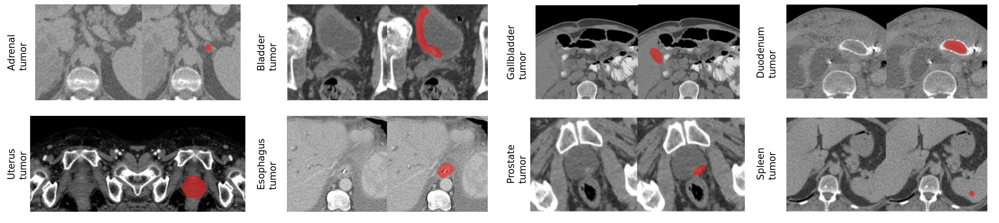
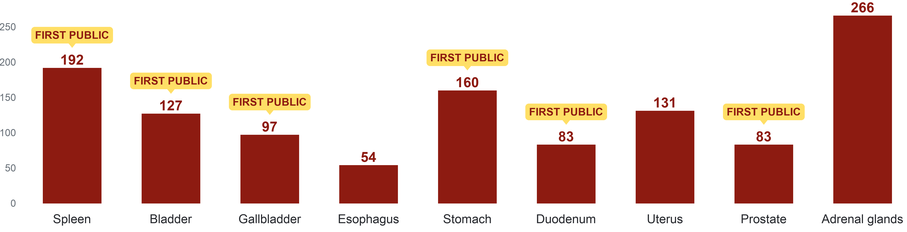
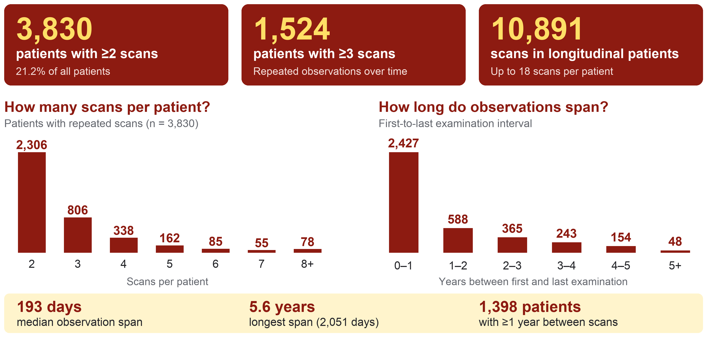
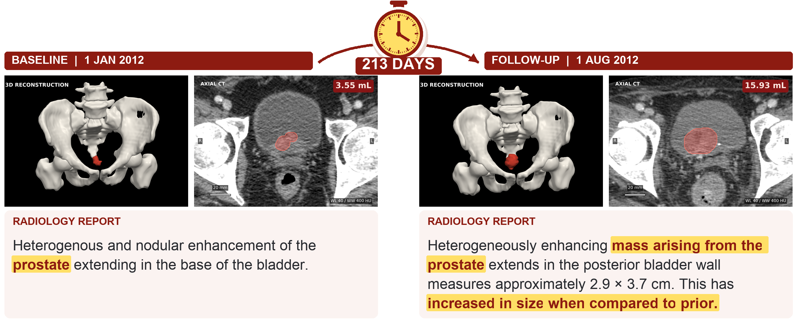
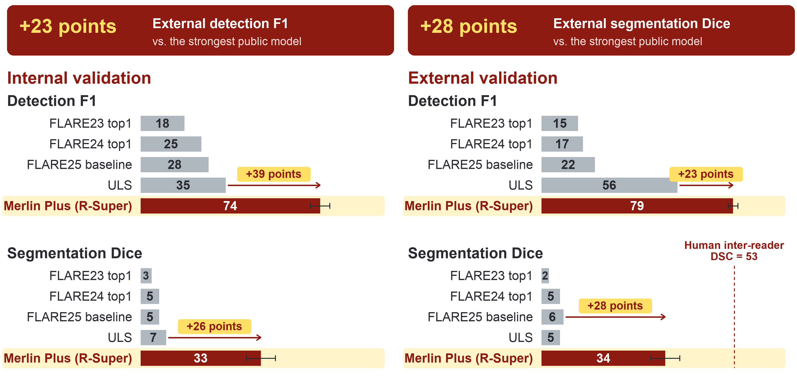
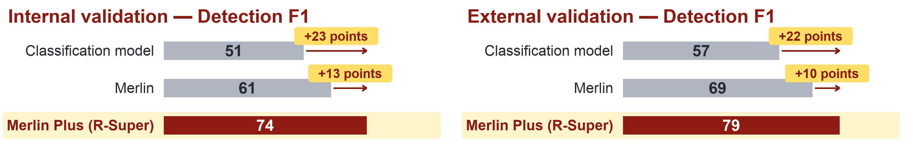

<p align="center">
  
</p>

<a href="https://huggingface.co/datasets/AbdomenAtlas/MerlinPlus">
  
</a>

<a href="https://github.com/MrGiovanni/MerlinPlus">
  
</a>

# Merlin Plus

This repository provides Merlin Plus, with **longitudinal metadata (patient IDs and scan dates) and per-voxel annotations for organs and 9 tumor types** in the Merlin dataset (Stanford, 25,494 CT scans).
Merlin Plus is part of a collaboration between the Merlin Project at Stanford and the R-Super Project at Johns Hopkins University. 

Merlin Plus is available at HuggingFace: https://huggingface.co/datasets/AbdomenAtlas/MerlinPlus


# Per-voxel Masks for 9 Tumors and 44 organs

- **Tumor Masks**: 1,193 masks created by radiologists. They cover tumors in 9 organs, most of which were unavailable in previous segmentation datasets. All confirmed malignant tumors were annotated, plus over 200 benigns. Unannotated tumors encompass other benign tumors and cases where we could not confirm malignancy or radiologists could not clearly see the tumor.

<p align="center">
  
</p>


- **Organ Masks**: created by AI models trained on more than 14,000 CT scans at Johns Hopkins University. Merlin Plus includes per-voxel annotations for **organs, blood vessels, organ parts** (liver and pancreas sub-segments), and ducts.

<details>
<summary style="margin-left: 25px;">Organ List</summary>
<div style="margin-left: 25px;">
  
```
adrenal gland left
adrenal gland right
aorta
bladder
cbd stent
celiac artery
celiac trunk
colon
common bile duct
duodenum
esophagus
femur left
femur right
gall bladder
hepatic vessels
intestine
kidney left
kidney right
liver
liver segment 1
liver segment 2
liver segment 3
liver segment 4
liver segment 5
liver segment 6
liver segment 7
liver segment 8
lung left
lung right
pancreas body
pancreas head
pancreas tail
pancreas
pancreatic duct
portal vein and splenic vein
postcava
prostate
rectum
renal vein left
renal vein right
spleen
stomach
superior mesenteric artery
superior mesenteric vein
```

</div>
</details>


- **Merlin Dataset**: Merlin Abdominal CT Dataset is an abdominal CT dataset consisting of 25,494 scans from 18,317 patients. Each scan is paired with its corresponding radiology report. The dataset includes abdominal and pelvis CT exams conducted between 2012 and 2018 at the Stanford Hospital.


# Paper

**Merlin Plus: A Large-Scale, Multi-cancer, Image-Mask-Report Dataset**  
Pedro R. A. S. Bassi†, Wenxuan Li†, Szymon Płotka†, Ruby Honjol, Jakub Prządo, Xinze Zhou, Kang Wang, Yang Yang, Malte Jensen, Akshay S. Chaudhari, Curtis P. Langlotz, Alan L. Yuille, and Zongwei Zhou.  
*MICCAI 2026, LNCS 16895. Springer Nature Switzerland.*  
<a href="https://papers.miccai.org/miccai-2026/paper/4063_paper.pdf"></a>
<a href="document/MICCAI2026-Merlin-Plus.pptx"></a>


<b>Learning Segmentation from Radiology Reports</b> <br/>
[Pedro R. A. S. Bassi](https://scholar.google.com/citations?user=NftgL6gAAAAJ&hl=en), [Wenxuan Li](https://scholar.google.com/citations?hl=en&user=tpNZM2YAAAAJ), [Jieneng Chen](https://scholar.google.com/citations?user=yLYj88sAAAAJ&hl=zh-CN), Zheren Zhu, Tianyu Lin, [Sergio Decherchi](https://scholar.google.com/citations?user=T09qQ1IAAAAJ&hl=it), [Andrea Cavalli](https://scholar.google.com/citations?user=4xTOvaMAAAAJ&hl=en), [Kang Wang](https://radiology.ucsf.edu/people/kang-wang), [Yang Yang](https://scholar.google.com/citations?hl=en&user=6XsJUBIAAAAJ), [Alan Yuille](https://www.cs.jhu.edu/~ayuille/), [Zongwei Zhou](https://www.zongweiz.com/)* <br/>
*Johns Hopkins University* <br/>
MICCAI 2025 <br/>
<b>Best Paper Award Runner-up (top 2 in 1,027 papers)</b>  <br/>
<a href='https://link.springer.com/chapter/10.1007/978-3-032-04971-1_29'></a><a href='https://link.springer.com/chapter/10.1007/978-3-032-04971-1_29'></a>

<p align="center">
  
</p>

<b>Merlin: A Vision Language Foundation Model for 3D Computed Tomography</b> <br/>
Louis Blankemeier, Joseph Paul Cohen, Ashwin Kumar, Dave Van Veen, Syed Jamal Safdar Gardezi, Magdalini Paschali, Zhihong Chen, Jean-Benoit Delbrouck, Eduardo Reis, Cesar Truyts, Christian Bluethgen, Malte Engmann Kjeldskov Jensen, Sophie Ostmeier, Maya Varma, Jeya Maria Jose Valanarasu, Zhongnan Fang, Zepeng Huo, Zaid Nabulsi, Diego Ardila, Wei-Hung Weng, Edson Amaro Junior, Neera Ahuja, Jason Fries, Nigam H. Shah, Andrew Johnston, Robert D. Boutin, Andrew Wentland, Curtis P. Langlotz, Jason Hom, Sergios Gatidis, Akshay S. Chaudhari  <br/>
*Stanford University* <br/>
*Nature, 2026.*  
<a href='https://www.nature.com/articles/s41586-026-10181-8'></a>


# Download

- **Download the CT Scans and Reports**: https://stanfordaimi.azurewebsites.net/datasets/60b9c7ff-877b-48ce-96c3-0194c8205c40

- **Download the Longitudinal Metadata (patient IDs and scan dates):** https://huggingface.co/datasets/AbdomenAtlas/MerlinPlus/blob/main/merlin_longitudinal_metadata.csv

- **Download the Organ and Tumor Masks**: https://huggingface.co/datasets/AbdomenAtlas/MerlinPlus

```bash
pip install -U "huggingface_hub>=0.34"
hf download AbdomenAtlas/MerlinPlus --repo-type dataset --local-dir ./MerlinPlusCompressed
bash MerlinPlusCompressed/unzip.sh --archive_dir MerlinPlusCompressed --out_dir MerlinPlus --workers 6
```


# Longitudinal Data

Merlin Plus provides anonymized patient IDs and scan dates to link CT scans and reports over time. **3,830 patients have two or more scans.**

<p align="center">
  
</p>

The example below shows prostate tumor growth across two time points, with corresponding CT images and radiology reports.

<p align="center">
  
</p>

# Improving AI Performance


>[!NOTE]
>See the [Report Supervision (R-Super) GitHub](https://github.com/MrGiovanni/R-Super) to discover how you can use Merlin Plus to improve **tumor segmentation**!


**Models trained on Merlin Plus surpass previous public AI models in tumor detection and segmentation.**

R-Super was the best performing tumor detection and segmentation model trained on Merlin Plus. R-Super is a novel AI training methodology that uses radiology reports and tumor masks to significantly improve tumor-segmentation AI. Merlin Plus makes R-Super easily reproducible for the medical AI community.  Results below are averaged over the 9 tumor types.

<p align="center">
  
</p>

**The value of masks: models trained on Merlin Plus surpass models trained on Merlin (no mask) in tumor detection and segmentation.**

<p align="center">
  
</p>


# Citations
If you use this data, please cite the papers below (Merlin Plus, R-Super, and Merlin Projects):

```bibtex
@InProceedings{BasPed_Merlin_MICCAI2026,
    author = { Bassi, Pedro R. A. S. AND Li, Wenxuan AND Płotka, Szymon AND Honjol, Ruby AND Prządo, Jakub AND Zhou, Xinze AND Wang, Kang AND Yang, Yang AND Jensen, Malte AND Chaudhari, Akshay S. AND Langlotz, Curtis P. AND Yuille, Alan L. AND Zhou, Zongwei},
    title = { { Merlin Plus: A Large-Scale, Multi-cancer, Image-Mask-Report Dataset } },
    booktitle = {Medical Image Computing and Computer Assisted Intervention -- MICCAI 2026},
    year = {2026},
    publisher = {Springer Nature Switzerland},
    volume = {LNCS 16895},
    month = {September},
    page = {pending}
}

@inproceedings{bassi2025learning,
  title={Learning segmentation from radiology reports},
  author={Bassi, Pedro RAS and Li, Wenxuan and Chen, Jieneng and Zhu, Zheren and Lin, Tianyu and Decherchi, Sergio and Cavalli, Andrea and Wang, Kang and Yang, Yang and Yuille, Alan L and others},
  booktitle={International Conference on Medical Image Computing and Computer-Assisted Intervention},
  pages={305--315},
  year={2025},
  organization={Springer}
}

@article{blankemeier2024merlin,
  title={Merlin: A vision language foundation model for 3d computed tomography},
  author={Blankemeier, Louis and Cohen, Joseph Paul and Kumar, Ashwin and Van Veen, Dave and Gardezi, Syed Jamal Safdar and Paschali, Magdalini and Chen, Zhihong and Delbrouck, Jean-Benoit and Reis, Eduardo and Truyts, Cesar and others},
  journal={Research Square},
  pages={rs--3},
  year={2024}
}

```

## Acknowledgement

This work was supported by the McGovern Foundation and the Lustgarten Foundation for Pancreatic Cancer Research. Paper content is covered by patents pending. Commercial use is not allowed.
