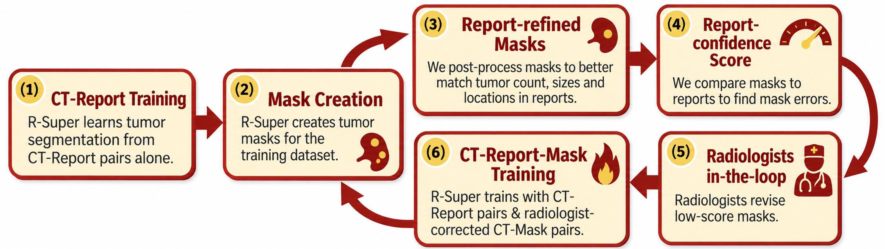

# Report-based Mask Refinement

We include post-processing code that can automatically refine AI-made masks to better match the tumor descriptions in radiology reports.

Merlin Plus was created with our new report-based active learning: R-Super first learns tumor segmentation from CT-report pairs alone and creates masks for the dataset. These masks are automatically refined to match the tumor count, size, and location in the reports, and each is given a report-confidence score. Radiologists revise the low-score masks, R-Super is retrained with the reports and corrected masks, and the loop repeats.


<p align="center">
  
</p>


All tumor masks in Merlin Plus were verified/corrected by radiologists.

# Use the refinement code

### Installation


<details>
<summary style="margin-left: 25px;">[Optional] Install Anaconda on Linux</summary>
<div style="margin-left: 25px;">
    
```bash
wget https://repo.anaconda.com/archive/Anaconda3-2024.06-1-Linux-x86_64.sh
bash Anaconda3-2024.06-1-Linux-x86_64.sh -b -p ./anaconda3
./anaconda3/bin/conda init
source ~/.bashrc
```
</div>
</details>

Create a new virtual environment and install all dependencies by:
```bash
conda create -n rsuper python=3.10
conda activate rsuper
pip install -r requirements.txt
```


### Extract tumor information from radiology reports

Please follow https://github.com/MrGiovanni/R-Super/tree/main/report_extraction

### Run the refinement code

```bash
python r_super_pseudo_masks.py --pred_root /path/to/masks/ --output_folder /path/to/refined/masks/ --source_ct /path/to/CT/scans/ --meta /path/to/report/metadata/from/previous/step.csv --reports /path/to/report/metadata_per_tumor/from/previous/step.csv

```


